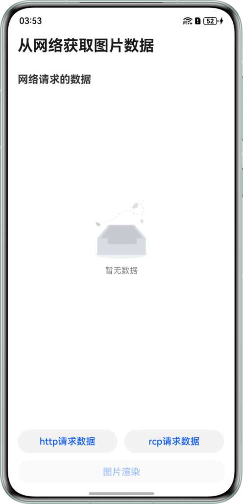
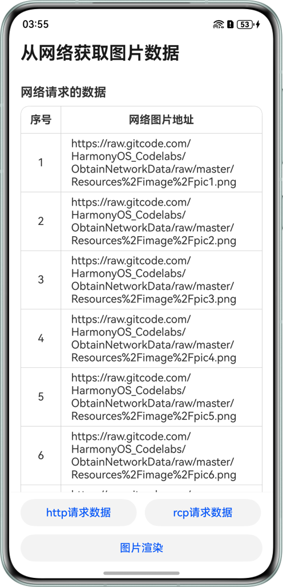
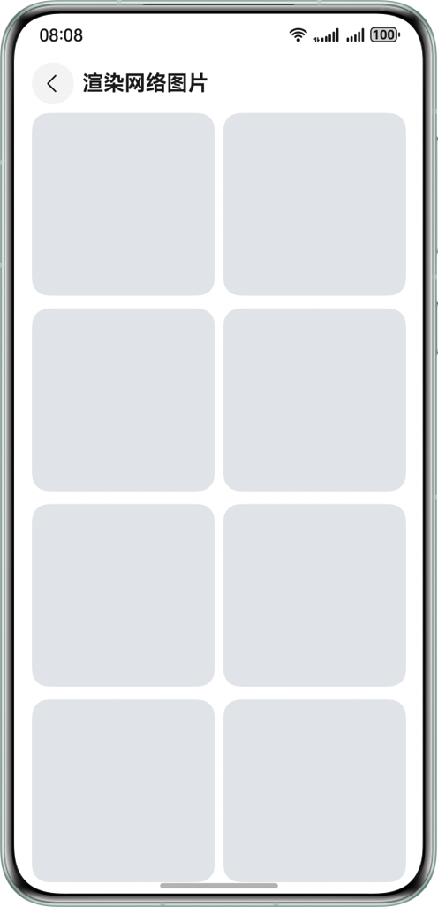

# 从网络获取图片数据

## 项目简介
本示例基于ArkUI的http及rcp模块请求获取网络数据，实现从网络获取图片链接JSON数据并渲染至页面的功能。

## 效果预览
| 首页（无数据）                                     | 首页（有数据）| 图片渲染页面（占位图）| 图片渲染页面 |
|---------------------------------------------|---------------------------------------------|----------------------------------------------------|----------------------------------------------|
|  |  |  |  |

## 使用说明

1. 首页下方，点击“http请求数据”按钮，发起HTTP请求，获取网络图片地址。
2. 首页下方，点击“rcp请求数据”按钮，发起RCP请求，获取网络图片地址。
3. 首页下方，点击“图片渲染”按钮，跳转到“网络图片渲染”页面。

## 工程目录
```
├──entry/src/main/ets                       // 代码区
│  ├──constants
│  │  └──Constants.ets                      // 公共常量类
│  ├──entryability
│  │  └──EntryAbility.ets                   // 程序入口类
│  ├──entrybackupability
│  │  └──EntryBackupAbility.ets             // Ability的生命周期回调内容
│  ├──model
│  │  └──ImgModel.ets                       // 公共类
│  ├──pages
│  │  ├──ImageDataPage.ets                  // 从网络获取图片数据页
│  │  ├──ImageRenderingPage.ets             // 网络图片渲染页
│  │  └──Index.ets                          // 首页
│  ├──utils
│  │  ├──RCPUtils.ets                       // rcp请求类（需补充）
│  │  └──WindowAvoidAreaUtils.ets           // 获取系统状态栏、导航条高度类
│  └──view
│     └──ImageDataView.ets                  // 网络数据列表
└──entry/src/main/resources                 // 资源文件目录
```

## 具体实现
1. 调用http.createHttp().request()接口，获取网络图片数据。
2. 调用rcp.createSession().get()接口，获取网络图片数据。
3. 使用ForEach遍历获取到的网络图片，使用alt()设置图片加载过程中显示的占位图，图片加载过程中展示占位图。
4. 使用backgroundBlurStyle为组件添加背景模糊效果，实现图片列表上滑时，状态栏和标题栏背景模糊效果。

## 相关权限
该应用需要使用网络权限，请在配置文件module.json5中添加以下权限：
* 允许使用Internet网络权限：ohos.permission.INTERNET。

## 约束与限制
1. 本示例仅支持标准系统上运行，支持设备：直板机。
2. HarmonyOS系统：HarmonyOS 5.0.5 Release及以上。
3. DevEco Studio版本：DevEco Studio 6.0.2 Release及以上。
4. HarmonyOS SDK版本：HarmonyOS 6.0.2 Release SDK及以上。